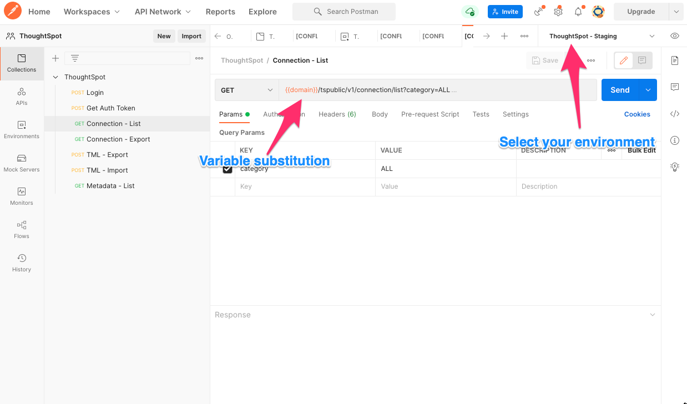

# Using ThoughtSpot Everywhere APIs & Postman

summary: ThoughtSpot 2hr Developer Workshop - extra exercise
id: ts-dev-workshop-short-2022-aug.2-bonus
categories: Meta
tags: intermediate
status: Published 
last updated: 2022/08/16
authors: Quinton Wall
Feedback Link: https://developers.thoughtspot.com

## Objectives / Goal

Duration: 03:00

ThoughtSpot Everywhere provides a rich suite of APIs for search, user controls, and platform metadata. These APIs can be especially useful for sharing data with partners via webhooks, building native mobile apps, providing results in json format for third-party charting libraries like D3, or scripting ThoughtSpot configuration to support devops and continuous integration toolchains.

ThoughtSpot metadata is referred to as  ThoughtSpot Modeling Language, or TML. TML is a JSON-based definition of configuration and elements within your ThoughtSpot instance.  The answers, liveboards, and data model you have used throughout this tutorial are all defined in TML. This makes TML very powerful for many administrative and devops tasks. For example, you can use the APIs and TML as part of a deployment script  to export a liveboard from a test environment and push it to  production. In this section, we will introduce the ThoughtSpot Everywhere Rest APIs by  using Postman, a free IDE designed for working with APIs. We will also demonstrate how, using TML you can retrieve ThoughtSpot elements for storing in version control or make changes for different environments

In this tutorial, you will learn how to use the ThoughtSpot Modeling Language and the ThoughtSpot Everywhere APIs to perform typical devops functions. 

## Postman

Duration: 10:00

To make things a little easier, we will use Postman to create and manage our API collections. Postman is a great resource to help test APIs calls especially when dealing with multiple environments where you must change tokens, passwords, URIs etc. Best of all, Postman is free. 

Start by downloading Postman and install it on your machine. Whilst Postman is not necessary, it makes it much easier to set up API endpoints and get request headers and parameters correct before adding commands to any sort of larger process. This way, you know my API calls are correct and always have a way of testing independently of other systems. If you prefer not to use Postman, all of the API calls can be completed using cURL or the <a href="https://www.thoughtspot.com/blog/the-developer-playground-now-supports-rest-api" target="_blank"> Rest API Playground</a>.

### Set global environment variables

Once downloaded, you will need to set up a couple of global environment variables. These variables are dynamically inserted into your commands similar to the way a variable in a bash script works. Global variables make switching between environments quick and keep sensitive information like usernames and passwords separate. For working with ThoughtSpot,it is good practice to create a set of variables per environment (e.g.dev, test, staging, production, etc.)  and add three global variables to it.  Go ahead and tap on environments, then + to add a new set. Let&#39;s call it <strong>TSE Workshop</strong>. Once created, add the following three variables:

- domain - The url of the cloud instance you are connecting to. For a trial instance, it is <code>https://try.thoughtspot.cloud/callosum/v1</code>

- username - The username of your ThoughtSpot account
- password - The password of your ThoughtSpot account

<strong>Note</strong>: Make sure you tap save to persist your changes. Even though you may have changed the values, they are not reflected in Postman until you save them.

### ThoughtSpot collection

To save developer&#39;s time, we have created a GitHub project with a set of ThoughtSpot APIs defined as a Postman collection. Over time, more endpoints will be added to this project. Make sure you follow and star it to keep up to date. For now, go ahead and <a href="https://github.com/thoughtspot/ts_everywhere_resources/tree/master/apis/postman" target="_blank">download the collection</a>. Then, import the ThoughtSpot collection by navigating to <strong>Collections &gt; Import</strong>, and selecting the file you downloaded. 

To keep things neat, it is a good idea to adopt a naming convention that begins with a prefix which identifies the category and ends with what the function does. As you add more endpoints, a consistent naming convention makes it easy to find the function, and it aligns well with how the <a href="https://developers.thoughtspot.com/docs/?pageid=rest-api-reference" target="_blank">API docs</a> are categorized. In the example below, we are using the Connection API to list all CDW connections in a ThoughtSpot instance. You can also see in the URL field the use of the <code>&#123;&#123;domain}}</code> variable we created.

<strong>Note</strong>: In order to ensure you are using the correct values, don&#39;t forget to select the environment from the dropdown on the top right of the workspace.

## Authentication

Duration: 05:00

Almost every task involving APIs requires authentication via login. Let&#39;s use this to get yourself familiar with what is required from ThoughtSpot, and a general understanding of how Postman works. Start by having your Connections workspace open in Postman and selecting Login. Most ThoughtSpot API requests require standard headers such as Content-Type and a Requested-By identifier the platform uses to determine payload formats. For login, the most important is the body attributes required to be passed in via a POST.  Here you can see where the global variables are being used to make it more convenient for you.

Make sure your environment is set to <strong>TSE Workshop</strong>, then tap send. The server response will appear in the bottom section of Postman showing the status of your request, and options for formatting the output. In the example below, the login attempt was unsuccessful because the user account has expired.

If you received an error message, double check your username and password global variables are correct, and the environment is set to <strong>TSE Workshop</strong>. When you receive a HTTP 200 message, you have successfully authenticated and an auth token is assigned to your postman session.

## Answers TML

Duration: 10:00

Now that you have successfully authenticated, let&#39;s use the metadata API to retrieve a list of Answer elements from your environment. We will use the metadata/list endpoint to return a TML definition of all answers in ThoughtSpot.

### List all Answers

Within your Postman collection, select Metadata - List. This endpoint takes a single parameter type. Type allows you to choose <a href="https://developers.thoughtspot.com/docs/?pageid=metadata-api#metadata-list" target="_blank">which type of element </a>you want to return. We are using QUESTION_ANSWER_BOOK. Tap Send and you should see a response appear in the lower window. If your response looks like a long string of JSON, make sure you change the response format to <strong>JSON</strong> and select <strong>Pretty</strong> in the response window.

### Retrieve Answer TML

Next, we want to retrieve the tml definition of the <strong>Sales Analysis Liveboard</strong> answer we created earlier. To do this, we need to use the answer id and use this as a parameter for the tml/export API endpoint. You can either retrieve this id from Developer Playound, the search.js page, or simply by searching the TML returned in the previous step for &#34;Sales Analysis Liveboard&#34;. Once you have the id, add it to the export_ids array in the TML - Export connection. This connection uses metadata/tml/export endpoint, which requires a HTTP POST. The export_ids must be passed as a body element. 

Once you have added the correct id, tap Send and see the TML payload returned in the lower window. This TML is an example of a file you would likely store in source control as a backup for your environments configuration.  Within the Postman response window, make sure the format is set to JSON, the means your IDEs and editors will automatically recognize the format and use correct syntax highlighting. 

### Prepare TML Payload

The output of the <code>tml/export</code> task above includes a json envelope which describes the tml.  We are going to simulate importing this into a different environment such as production via the API. First, we need to remove the envelope. If you were doing this in a real environment, you would write a script to extract the required element, or use an open source toolkit like <a href="https://github.com/thoughtspot/ts_rest_api_and_tml_tools" target="_blank">TML tools</a>, written by ThoughtSpot.  For the workshop, we will simply copy the element we need.

Select all of the output from the tml/export in the Postman response window, making sure the output is set to JSON and Pretty. Copy the contents to the clipboard. Then, open your IDE and create a new file. Paste the contents into this file. Now select and copy the value of the edoc key, including the double quotes. (This will start with <code>"guid</code>).

If you prefer not to copy and paste, and already have python installed on your computer, you may want to use <a href="https://gist.github.com/quintonwall/2ee0fbd2a65e2e6c6caaed7dcf436e2c" target="_blank">this handy helper utility</a> to correctly extract edoc data. 

### Import TML

Return to Postman and select the <strong>TML - Import (Validate)</strong> collection item. Tap the <strong>Body</strong> tab and replace the value of the <code>import_objects</code> within the <code>[]</code> with your snippet. Then, tap save. You will notice that we have the <code>import_policy</code> set to <code>VALIDATE_ONLY</code>. We can use this policy to test our TML syntax without actually writing the file. If you want to make a destructive change and write the TML you can do so using the <code>PARTIAL</code> or <code>ALL_OR_NOTHING</code> policy.

When you are ready, tap send to execute the request. Congratulations, you just learned how to use TML and the metadata APIs to complete a typical devops process with ThoughtSpot.

## Summary

During these exercises, you were introduced to the ThoughtSpot Everywhere platform APIs and TML. You used Postman to manage API collections and perform typical tasks. With a understanding of these APIs and the power of metadata, you can create scripts to integrate ThoughtSpot into existing devops toolchains such as version control and continous integration. 