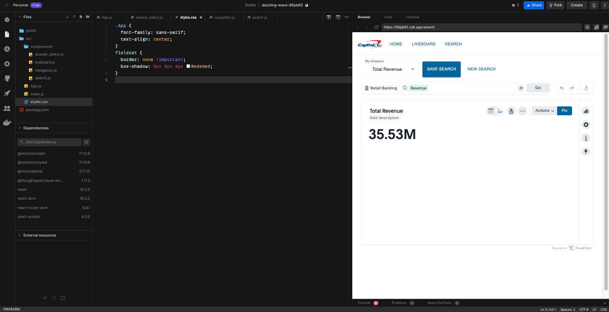

# ThoughtSpot Developer Workshop


summary: ThoughtSpot 2hr Developer Workshop
id: ts-dev-workshop-short-2022-dec.1
categories: Meta
tags: beginner, intermediate
status: Published 
last updated: 2022/12/06
authors: Quinton Wall
Feedback Link: https://developers.thoughtspot.com


## Objectives / Goal
Duration: 05:00

This workshop is designed to introduce developers to ThoughtSpot Everywhere, how to embed analytics into JavaScript-based web applications, and integrate ThoughtSpot into typical devops toolchains. No prior experience, or paid software licenses, is required.

### What you will learn

The workshop is broken into 2 parts, with the learning objectives as follows. Each part is intended to build upon the last. You must complete one before moving onto the next.

#### Part 1: Build with Low Code Developer Tools

*   How to create search, visualizations, and liveboards to analyze data
*   How to use the developer playground to generate javascript code to embed ThoughtSpot elements into a web app
*   How to modify actions available to users and apply hidden runtime filters

#### Part 2: Embed Analytics with Visual Embed SDK

*   How to use the Visual Embed SDK to embed ThoughtSpot components into a ReactJS web app
*   Using the platform event framework to interact with embedded components

#### Bonus: Using Platform APIs and TML

* How to use ThoughtSpot Everywhere APIs and ThoughtSpot Modeling Language to perform typical devops tasks
* Using Postman to manage API collections with ThoughtSpot


### Access ThoughtSpot Cloud Environment

To begin, [log in](https://cap1slingshot.thoughtspot.cloud/) to the ThoughtSpot environment. In the previous portion of the workshop you have created a set of liveboards and answers. For this portion of the workshop we will leverage that work to begin embedding visualizations into a custom application


## Embed using the Developer Playground
Duration: 0:20:00


In the previous portion of the workshop you have learned how to use the ThoughtSpot interface to create answers and liveboards. Now, it is time to take advantage of the Developer Playground. The Developer  Playground is a visual tool to help to build, test, and iterate on embedded components, prior to adding to your webapp. Unlike traditional approaches to development which require you to read documentation to piece together supported attributes, and configure local environments just to test your solution, the Developer Playground let's you quickly build your embed solution with confidence, greatly reducing time-to-market and avoid syntactical errors. 


1. Select **DEVELOP** on the ThoughtSpot top navbar to open the Developer playground.  


The Develop area contains 4 sections: Home, Guide, Playground, Customizations.

* **Home** provides immediate access to overview, 3 methods for embedding Search, Visualizations, and Pinboards, plus 1 method for accessing data via API where you then control how you want to visualize it.

* **Guide** provides quick access to all of the visual embed commands and Rest API calls.

* **Playground** provides a cloud-based sandbox environment to generate and test code needed to embed the ThoughtSpot Search experience, Visualizations/Liveboards that you or others on your team create, and the Full ThoughtSpot App (white labeling).

* **Customizations** provide access to creating custom Actions that can invoke a URL or trigger a callback in your parent application, changing the Styles (look and feel) for app, visualizations, and white labeling, establish Security Settings to configure automatic authentication and query data programmatically with the REST API.  

  _Note: Customizations are only available in the paid version of ThoughtSpot and not the free trial._


### Embed a Liveboard

Begin the playground experience by embedding the liveboard you created into the sample data app sandbox provided within the Developer Playground .

1. Select **Liveboard** from the **Playground** menu.  

If this is your first time doing this, a Start tour option is shown which will guide you through the steps to select and embed the ThoughtSpot object. For now, select No Thanks. Use the Start Tour button on the nav bar to revisit any time in free trial.  

2. The ‘Select feature to embed' is already set to Liveboard, select your pinboard and run to view it in the sample app

3. Select your Liveboard "**Retail Banking Analysis**" from the drop-down selection menu and notice that upon choosing the liveboard, the code window on the bottom left automatically highlights the code that you would copy/paste directly into your data app.  

4. Select ‘ **Run** to render it in the sample SpotShop data app window.  


### Modify available actions

There are many actions that can be disabled or hidden for example and all are documented in the [Visual Embed guide](https://developers.thoughtspot.com/docs/?pageid=action-config) accessible from the **Develop** page. 

1. First, look at the default actions available for a particular embedded component such as a Search or Liveboard item.

   

2. Whilst still in the developer playground, make sure you have the  **Retail Banking Analysis**, then select the **Modify available actions** checkbox. This will add a code snippet into the editor section. 

3. Enter "**Action.Save**" inside the "[]" for the `disabledActions` setting.

5. Change the "Reason for disabling" to "**Premium action, request upgrade.**" for the `disabledActionReason`

6. Enter "**Action.MakeACopy,Action.DownloadAsPdf,Action.AddFilter**" inside the "\[\]" for the `hiddenActions` setting.

7. Select ‘ **Run** to render the changes.

8. Select the pinboard menu "..." to view the results.

9. Hover over **Save** to see the reason. Notice the other actions specified above are hidden.


You have successfully applied modified actions.


### Set runtime filters

Applying run time filters provides additional controls on who can see what data. You may opt for forcing a particular filter based upon the user's role for example, or perhaps you would like to present filter choices in your own data app nav bar and push the selected values that the user selects.  


1. The current liveboard, Retail Banking Analysis, includes the Total Revenue by Monthly Date chart. This shows a trend of revenue across all product categories. You will apply a run time filter to set the Product Category to *Loans* so chart only shows the trend for the Loans products.

2. Select **Set runtime filters** under User experience customizations in the playground left pane. Notice the code window again, highlighting the code to be affected.

3. Change *columnName1* to **‘Product Category'** and *value1* to **‘Loans'**

4. Select **Run** to render the changes.  


You can also add multiple runtime filters. Let's add one more filter to show only the data for bags. .

1. Copy the runtime filter code and paste it below the existing entry. Make sure you add an additional comma directly after ['Product Category']
2. Modify ‘Product Category' in the 2nd run time filter to **Gender** and change ‘Loans' to ‘**Male**'.
3. Select ‘ **Run** to render the changes. Now data is filtered by Loans issued specifically to Males.


### Embed a Search

Let's go ahead and use the Developer Playground to embed and customize a search component. 

1. The ‘Select feature to embed' to **Search**

2.  Select your datasource "**Retail Banking**" from the drop-down selection menu and notice that upon choosing the datasource, the code window on the bottom left automatically highlights the code that you would copy/paste directly into your data app.  

3.  Select ‘ **Run** to render it in the sample SpotShop data app window.  


_Note: Search suggestions will automatically appear in the search bar based upon what you did previously._

3. Enter in the search bar: Revenue Weekly Product Category

4. Then press **Enter**, Select **Go**, or **click** below the search bar to launch the query. While you can change the chart time, keep this one for now.

   

   

   

***Note**: As an option you may want to enter some starting search tokens like Sales Region and let the user add more before sending the live query to the cloud data warehouse. Do that in the next task.*  


There are three search related actions `\[Collapse data panel, Hide data panel, Add search tokens\]` shown below. You will apply all for this task to create a starting point search and allow the user add more and then initiate the search.

1.  Select **Collapse data panel**
2.  Select **Hide data panel**

3.  Select **Add search tokens**

4.  Make the following changes to add search tokens, turn off automatic search and test it.

5.  Enter "**\[Revenue\] \[Product Category\]**" inside the ‘' (single quotes for the searchTokenString setting.
6.  Change the "true" to "**false.**" for the executeSearch setting.
7.  Select ‘ **Run** to render the changes.

8. Enter "**Monthly**" in the search bar and press **Go** to run the search and voila, user self-service!


## Part 1 Summary
Duration: 0:03:00

Congratulations for making it to the end of Part 1. So far, we have created everything *on-platform*, using the low-code developer tools. In Part 2, you will build a webapp with a simple hamburger navigation. This app will be written in ReactJS, a very popular JavaScript framework, and use the Visual Embed SDK and ThoughtSpot React components to embed Search, Liveboards, and the full ThoughtSpot app into a webapp.


## Part 2 Embed Analytics with the Visual Embed SDK
Duration: 0:05:00

In part 2, you will build a ReactJS webapp with a simple hamburger navigation, and use the ThoughtSpot Visual Embed SDK to embed live analytics. 

To make things easy, we will use CodeSandbox, a web based IDE and runtime environment for building web apps. Using CodeSandbox means we don’t need to spend time configuring our local environment for React development. The good news is that ThoughtSpot Everywhere uses the languages and developer processes you already know and love. If you already have your local environment setup for React development, feel free to use that too. 

**Note**: You can also follow along using the [completed app running in CodeSandbox](https://codesandbox.io/s/keen-einstein-1g9vrl). This sandbox app is fully functional, but uses the componentid from another ThoughtSpot instance. To make it work for you, you can substitue your ids, or better still, follow along in the workshop and build it all yourself.

## Configure your app
Duration: 0:10:00

In your browser, go to [codesandbox.io](http://codesandbox.io) and tap the **Create a Sandbox** button on the top right of the page, then select the **React** template. This will create a very simple web app, with code on the left, and rendered page on the right. Next, we have to add a few dependencies to our project.  Be cafeful to add the correct library as there are a a few similarly named libraries to the ones we need.

1. ThoughtSpot Visual Embed SDK
   - Type *@thoughtspot* into the dependency pane, then select the `Visual Embed SDK` from the autocomplete dropdown.


2. Material UI
   - Type *@mui/material* into the dependecy page and select the corresponding package.
   - Type *@emotion/react* into the dependecy page and select the corresponding package.
   - Type *@emotion/styled* into the dependecy page and select the corresponding package.

3. React Router Dom
   - Type *react


With your dependencies added, let's start by configuring the authentication to ThoughtSpot.

Replace the contents of your App.js file with:

```React
import React from "react";
import { AuthType, init } from "@thoughtspot/visual-embed-sdk";

var baseURL = "https://cap1slingshot.thoughtspot.cloud/";

init({
  thoughtSpotHost: baseURL,
  authType: AuthType.None
});

function App() {
  return (
    <div className="App">
      Hello ThoughtSpot!
    </div>
  );
}

export default App;
```


## Configure Simple Navigation


### Create Navigation Component

To navigate around our application, lets create a simple navigation bar. In this example, we are using components from [Material UI](https://mui.com/) to help us build something nice looking quickly. First lets create a simple horizontal container, with a button that links refers to the base url `/`.

Create a new file in the `components` folder called **navigation.js**. and add the following code:

```React
import { Stack, Button } from "@mui/material";

export default function Navigation(){
    return (
        <Stack direction={"row"} spacing={2} style={{padding:'10px',borderBottom:'1px solid #cccccc'}}>
            <Button  href="/">
            Home
            </Button>
        </Stack>  
    )
}

```

Next, let's go back to the **App.js** file and import our `Navigation` component. At the top of the file, add a new import:

```React
import Navigation from './components/navigation';
```

Then, above `Hello ThoughtSpot!` add the component itself:

```React
function App() {
  return (
    <div className="App">
        <Navigation></Navigation>
        Hello ThoughtSpot!
    </div>
  )
}
```


### Setup React Router.

In the end, we will create components for several different embed types including liveboards and searches. To handle the navigation between these components we will use react router.

First, in **App.js**, add an import for react-router-dom, and Material UI's `Typography` and `Container`. This can go below the Navigation import we just added.

```React 
import { BrowserRouter, Routes, Route } from 'react-router-dom';
import { Typography, Container } from '@mui/material';

```

Next, lets replace `Hello ThoughtSpot!` with a Material UI container, and Routes to each URL we wish to create. In this case we only have the Home page, so we will simply render the word `Home`. 

```React
function App() {
  return (
    <div className="App">
        <Navigation></Navigation>
        <Container style={{height:'calc(100vh - 60px)',overflow:'auto', paddingTop:'25px'}}>
        <BrowserRouter>
          <Routes>
            <Route path="/" element={<Typography>Home</Typography>} />
          </Routes>
        </BrowserRouter>
      </Container>
    </div>
  )
}
```


Once complete, your default app and project should look like this:


You will notice that the code includes some logic to authenticate with ThoughtSpot. In this tutorial, we are using AuthType.None. This will prompt the user to log in when the page loads. This is fine for the tutorial, but not recommended for a production app. For a detailed overview of security options supported by the Visual Embed SDK, please check out the [online documentation](https://developers.thoughtspot.com/docs/?pageid=embed-auth). 

## Create the liveboard page
Duration: 0:15:00

With the app structure set up and running, the next task is to add a new page to embed a search component. Within your IDE, select the `components` folder and add a new file **liveboard.js**.


Then, add the required React and Visual SDK import to `liveboard.js`. 

```react
import React from 'react';
import { LiveboardEmbed } from '@thoughtspot/visual-embed-sdk/react';
```

And, finally add a liveboard function below your imports. This function will return a snippet of HTML which gets rendered on display. Within this snippet we want to embed our answers component. Previously, in the Developer Playground section, you saw how you generate standard JavaScript code. For your convenience, the Visual Embed SDK also ships with React components. In this example, we will use the LiveboardEmbed component.

```react
export default function Liveboard() {
 return (
      <LiveboardEmbed
        fullHeight={true}
        liveboardId={"ef2b8ff9-fabe-4a93-87b5-89896af760c6"}
      />
  )
}
```


Looking at the liveboard embed component, you will see parameters you are already familiar with from the Developer Playground task previously. 

Notice that the LiveboardEmbed requires a `liveboardId`. In this case we have provided a default id. But there are two other ways you can obtain the UUID.

- Search for the livebaord in the Developer Playground and copy the ID from the generated code.
- Navigate to the liveboard in the ThoughtSpot UI and observe the URL. The first UUID is that of the liveboard itself.

We have also specified `fullHeight` to be true. This means that the liveboard container will automatically expand to the height of the liveboard itself.

### Add the component to your application

Open **App.js** and add an import for the liveboard component:

```React
import Liveboard from './components/liveboard';
```

Next we can add a new Route after `Home`, that renders the liveboard on the URL `/liveboard`:

```react
function App() {
  return (
    <div className="App">
    
        <Navigation></Navigation>
        
        <Container style={{height:'calc(100vh - 60px)',overflow:'auto', paddingTop:'25px'}}>
          <BrowserRouter>
            <Routes>
              <Route path="/" element={<Typography>Home</Typography>} />
              <Route path="/liveboard" element={<Liveboard/>} />
            </Routes>
          </BrowserRouter>
        </Container>
    </div>
  )
}

```

Finally, let's add the new route to the navigation bar. Open **componets/navigation.js** and add a new button that links to the URL `liveboard`:

```react
export default function Navigation() {
  return (
    <Stack direction={"row"} spacing={2} style={{ padding: "10px", borderBottom: "1px solid #cccccc" }}>
    
      <Button href="/">Home</Button>
      
      <Button  href="/liveboard">
        Liveboard
      </Button>
      
    </Stack>
  );
}

```

Save everything, and your app will automatically reload on the lefthand side. If everything is completed correctly, you will be presented with the home page as before, but now in the navigation bar you will have an additional link to `Liveboard`. Tap that link to open the new page. Since this is your first time accessing the page you may be prompted to log into ThoughSpot, do this with the credentials provided. You should now see an embedded liveboard, Good job!


## Embed Search Component
Duration: 0:10:00

Embedding a Search component is very similar to what you just completed with the Liveboard component. You need to create a new page and add the Search component, then add it to your routes and the navigation menu. Let's jump right in.

### Create the Search page

Add a new file, **search.js** in the `components` directory, and add the following code:

```react
import React, { useState } from "react";
import {SearchEmbed, useEmbedRef} from "@thoughtspot/visual-embed-sdk/react";
import { Stack } from "@mui/system";

export default function Search() {
  
    return (
        <Stack spacing={2}>
        
            <SearchEmbed
              collapseDataSources={true}
              frameParams={{ height: "600px" }}
            />
            
        </Stack>

    );
}
```

The syntax for this looks very similar to the liveboard component, but in this case we are using the SearchEmbed, with a few new parameters.

We have hardcoded the search `height` to be 600px, and we have specified `collapseDataSources` to be true. This means that the typical left-hand Data panel where you can select columns via clicking, is collapsed by default. This is one of the many options we can pass to control the look and behavior of the embedded object. 

### Add Search Route

Open **App.js** and import the Search component after the Liveboard import:

```react
import Search from './components/search';
```


Then, add the function to the `Routes` element after the Search route:

```react
<Route path="/search" element={<Search />} />
```


### Add Search to the navigation menu

Open **components/navigation.js** and add a button to the search route, after the liveboard navigation item:

``` react
export default function Navigation() {
  return (
    <Stack direction={"row"} spacing={2} style={{ padding: "10px", borderBottom: "1px solid #cccccc" }}>
      
      <Button href="/">Home</Button>
      
      <Button  href="/liveboard">
        Liveboard
      </Button>
      
      <Button  href="/search">
        Search
      </Button>
      
    </Stack>
  );
}
```
Click on the new navigation link to test the search embed, and give a simple search a shot. 

**Revenue monthly Product Category**

 


## Create an Answer Select Menu.
Duration: 0:15:00

Searching by itself is great, but you will also want to save and re-visit your searches later. A saved search is called an **Answer** and we can load answers using the same search component we just created by specifying an `answerId`. As we did with the liveboard, we could find a hardcoded ID through the developer playground. But in this case we want to make it more dynamic, so let's create a new select component that will allow a user to choose from a list of all of the answers that they have saved.

### Using REST API Calls

In order to retrieve a list of all answers availabile to a user we can leverage the ThoughtSpot REST API.  This is one of the many tasks that the APIs can be used for, including:

- Controlling users and permissions
- Retrieving login tokens
- Querying data
- Querying content
- Version control

Let's take a few minutes to explore the other REST APIs available to us in the ThoughtSpot UI. Navigate to the Rest API V2 playground in the ThoughtSpot UI Develop page.
[https://cap1slingshot.thoughtspot.cloud/#/develop/api/rest/playgroundV2_0](https://cap1slingshot.thoughtspot.cloud/#/develop/api/rest/playgroundV2_0)

Take a second to explore the various calls availbe to us.

Now click on the API call called `Search Data` under the `Data` section. This endpoint can be used to retrieve the result of a search query in JSON format. This requires three variables. 

Set the `query_string` equal to **[Revenue]** **[Product Category]** 
Set the `logical_table_identifier` to **4598e2bf-5d86-4892-84dc-a9686eb5a8ac**. This is the ID of our Retail Banking worksheet.
Set the `data_format` to **Compact**

Click **Try it Out** in the bottom right hand corner and explore the resulting dataset. 


### Create an AnswerSelect component

Coming back to our original goal of creating a select menu that contains a list of all answers the user created. To do this we will need to query the metadata within ThoughtSpot.

In this example we will leverage the V1 API's `metadata/list`:
[https://developers.thoughtspot.com/docs/?pageid=metadata-api#metadata-list](https://developers.thoughtspot.com/docs/?pageid=metadata-api#metadata-list)

The equivialant call in V2 can be found here:
[https://developers.thoughtspot.com/docs/?pageid=rest-apiv2-reference#_metadata](https://developers.thoughtspot.com/docs/?pageid=rest-apiv2-reference#_metadata)


First, create a new file in the `components` folder called **answer_select.js**, and add the following code:

```react
import { FormControl, InputLabel, MenuItem, Select } from "@mui/material"
import { useEffect,useState } from "react"

export default function AnswerSelect(props){
    const {
        selectedAnswer,
        selectAnswer
    } = props

    const [answers,setAnswers] = useState([])

    useEffect(()=>{
        var baseURL = "https://cap1slingshot.thoughtspot.cloud/"

        fetch(baseURL+"callosum/v1/tspublic/v1/metadata/list?type=QUESTION_ANSWER_BOOK&category=MY",
        {
          credentials: 'include',
        })
        .then(response => response.json())
        .then(data => {
            if (data.headers){
                setAnswers(data.headers)
            }
        })
    },[selectedAnswer])

    return (
        <FormControl>
            <InputLabel id="demo-simple-select-label">My Answers</InputLabel>
            <Select 
                style={{width:'200px'}}
                label="Select Answer"
                value={selectedAnswer ? selectedAnswer : ''}
                onChange={(e)=>selectAnswer(e.target.value)}
            >
                {answers.map((answer)=>{
                    return <MenuItem value={answer.id}>{answer.name}</MenuItem>
                })}
            </Select>
        </FormControl>
    )
}
```
Let's take a look at what this does. First, this component is based on the [Material UI Select](https://mui.com/material-ui/react-select/) component, which simply requires a list of `MenuItem` objects, much like a standard select input. To obtain this list we are are making a `fetch` call in the components `useEffect` function. 

The key to note here is the use of ```credentials: 'include'```. Since we have already logged into ThoughtSpot, the session is able to be maintained in the browser. When we send the REST API call to ThoughtSpot we simply need to ensure that the Browser authentication comes along with, and ThoughtSpot will be able to use this authenticate oure user automatically. 

Because **category** is set to `MY`, ThoughtSpot will look at the authenticated sesison and only return the list of Answer objects available to the user.

To store the list of available answers, we are using a state object of the array type called `answers`: ```const [answers,setAnswers] = useState([])```

Finally we map a list of `Menu Items` into the Select component, setting the value equal to the answer's Id and the display equal to the answer's Name.

### Add AnswerSelect to the Search Page

Navigate to the **components/search.js** file.

Add the import for the AnswerSelect component.

```react
import AnswerSelect from "./answer_select";
import { Stack } from "@mui/system";
```

Add a new state object called `selectedAnswerId`. You can add this right above `const embedRef`.

```react
  const [selectedAnswerId, setSelectedAnswerId] = useState(undefined)
```

Create a function to update the selected answer given an answer Id. This will be used by the answer select we just created, and can be placed below the `const embedRef`

```react
  function toggleAnswerSelect(answerUUID){
      setSelectedAnswerId(answerUUID)
  }
```

Insert the AnswerSelect component. In this case we will create a horizontal menu of buttons using a Material UI Stack. Place this on top of the `SearchEmbed`

```react
<Stack direction={"row"}>
  <AnswerSelect
      selectAnswer={toggleAnswerSelect}
      selectedAnswer={selectedAnswerId}
  ></AnswerSelect>
</Stack>
```
Update the `SearchEmbed` to refer to the currently selected answerId.

```react
<SearchEmbed
  collapseDataSources={true}
  frameParams={{ height: "600px" }}
  answerId={selectedAnswerId}
  ref={embedRef}
/>
```

Finally, let's add a button to reset the `answerId` for a brand new search. Add an import for Material UI Button.

```react
import { Button } from "@mui/material";
```

Below the `AnswerSelect` component, add a new Button that when clicked sets the `selectedAnswerId` to **undefined**. 

```react
<Button onClick={()=>setSelectedAnswerId(undefined)}>
    New Search
</Button>
```

Your final code should look like the following:

```
import React, { useState } from "react";
import { SearchEmbed, useEmbedRef } from "@thoughtspot/visual-embed-sdk/react";
import { Stack } from "@mui/system";
import AnswerSelect from "./answer_select";
import { Button } from "@mui/material";

export default function Search() {
  const [selectedAnswerId, setSelectedAnswerId] = useState(undefined)

  const embedRef = useEmbedRef();

  function toggleAnswerSelect(answerUUID){
      setSelectedAnswerId(answerUUID)
  }
  return (
    <Stack spacing={2}>
      <Stack direction={"row"}>
        <AnswerSelect
            selectAnswer={toggleAnswerSelect}
            selectedAnswer={selectedAnswerId}
        ></AnswerSelect>
        <Button onClick={()=>setSelectedAnswerId(undefined)}>
            New Search
        </Button>
      </Stack>
      <SearchEmbed
        collapseDataSources={true}
        frameParams={{ height: "600px" }}
        answerId={selectedAnswerId}
        ref={embedRef}
      />
    </Stack>
  );
}
```


## Using Lifecycle Events
Duration: 0:05:00

ThoughtSpot Everywhere makes it easy to embed analytics into any webapp via the Visual Embed SDK. In addition to embedding components, the SDK also provides support for analytics lifecycle events such as when a search term has changed, new data is loaded, or a component is rendered on the page. In this tutorial, you will learn the different types of lifecycle events and how to utilize them to make more dynamic interactions. You will use the app you just created and extend it to support lifecycle events

### Event Types

Lifecycle events fall into two categories:

1. EmbedEvents
   1. EmbedEvents occur when the state of a component changes or is interacted with. This may be something like the component is rendered, new data is loaded, or a user clicks on a visualization
2. HostEvents 
   1. HostEvents are hooks to allow the developer to programmatically change or update an embedded component. For example, you may want to change the search term used, or enable/disable features


## Add an Embed Event
Duration: 0:05:00

Currently our list of answers shows us everything available to the user as of the time it was loaded. But what happens when a user wants to save one of their existing searches? Give it a shot:

1. Type **Revenue Product Category** into the search
2. Click the three dots icon and select `Save`
3. Give it a good name and finish saving.

Notice that the list has not updated. If you refresh the page, you will see that the changes are finally picked up. This is because of the way that state works in React, our search bar had no idea that the user clicked save. We can smoothen this workflow by listening for the **Save** EmbedEvent.
First import the EmbedEvent enum from the ThoughtSpot SDK:

```react
import { EmbedEvent } from "@thoughtspot/visual-embed-sdk";
```

Add a new function called onSearchLoad. Because we are using React, we need to use the embedRef to add listeners and trigger events. In this case we are listening for the `EmbedEvent.Save`, which will fire when the user finishes saving the searcg.  To make this even more convenient for us, ThoughtSpot includes the newly saved `answerId` in the event data, which we can use to update the `selectedAnswerId`.

```react
function onSearchLoad(){
  embedRef.current.on(EmbedEvent.Save, (event)=>{
    setSelectedAnswerId(event.data.answerId)
  })
}
```

Add new parameter to the SearchEmbed to call this function:

```react
<SearchEmbed
  onLoad={onSearchLoad}
  collapseDataSources={true}
  frameParams={{ height: "600px" }}
  answerId={selectedAnswerId}
  ref={embedRef}
/>
```

Your final code should look like this:

```react
import React, { useState } from "react";
import { SearchEmbed, useEmbedRef } from "@thoughtspot/visual-embed-sdk/react";
import { Stack } from "@mui/system";
import AnswerSelect from "./answer_select";
import { Button } from "@mui/material";
import { EmbedEvent } from "@thoughtspot/visual-embed-sdk";


export default function Search() {
  const [selectedAnswerId, setSelectedAnswerId] = useState(undefined)

  const embedRef = useEmbedRef();
  function onSearchLoad(){
    embedRef.current.on(EmbedEvent.Save, (event)=>{
      setSelectedAnswerId(event.data.answerId)
    })
  }
  function toggleAnswerSelect(answerUUID){
      setSelectedAnswerId(answerUUID)
  }
  return (
    <Stack spacing={2}>
      <Stack direction={"row"}>
        <AnswerSelect
            selectedAnswer={selectedAnswerId}
            selectAnswer={toggleAnswerSelect}
        ></AnswerSelect>
        <Button onClick={()=>setSelectedAnswerId(undefined)}>
            New Search
        </Button>
      </Stack>
      <SearchEmbed
        onLoad={onSearchLoad}
        collapseDataSources={true}
        frameParams={{ height: "600px" }}
        answerId={selectedAnswerId}
        ref={embedRef}
      />
    </Stack>
  );
}
```

## Add a Host Event
Duration: 0:05:00

We now know when a save has been triggered, let's do the opposite. Let's create a button that kicks off the save process.

### Trigger Save Event

First, in **components/search.js** update the import to include the HostEvent enum.

```react
import { EmbedEvent, HostEvent } from "@thoughtspot/visual-embed-sdk";
```
Next, add a function that triggers the `HostEvent.Save`:

```react
function saveSearch(){
    embedRef.current.trigger(HostEvent.Save)
}
```

Instead of simply adding the Button, let's take this a step further and conditionally render Buttons based on whether the user is creating a new search or is looking at an existing Answer. Currently we know this by the `selectedAnswerId`. If this is undefined, then the only action that makes sense is to **Save**. If this has a value, then the user is looking at an existing answer **New Search** will be more relevant.

Replace the New Search button with the following code:

```react
<Button onClick={saveSearch}>
  Save Search
</Button>
{selectedAnswerId ? (
  <Button onClick={() => setSelectedAnswerId(undefined)}>
    New Search
  </Button>
) : null}
```

Give it a shot! When you are viewing an existing Answer, the Save button will update the answer. When you click "New Search" and start fresh, the save button will create a brand new Answer.

Your final code should look like this:

```react
import React, { useState } from "react";
import { SearchEmbed, useEmbedRef } from "@thoughtspot/visual-embed-sdk/react";
import { Stack } from "@mui/system";
import AnswerSelect from "./answer_select";
import { Button } from "@mui/material";
import { EmbedEvent, HostEvent } from "@thoughtspot/visual-embed-sdk";

export default function Search() {
  const [selectedAnswerId, setSelectedAnswerId] = useState(undefined);

  const embedRef = useEmbedRef();
  function onSearchLoad() {
    embedRef.current.on(EmbedEvent.Save, (event) => {
      setSelectedAnswerId(event.data.answerId);
    });
  }
  function toggleAnswerSelect(answerUUID) {
    setSelectedAnswerId(answerUUID);
  }
  function saveSearch() {
    embedRef.current.trigger(HostEvent.Save);
  }
  return (
    <Stack spacing={2}>
      <Stack direction={"row"}>
        <AnswerSelect
          selectedAnswer={selectedAnswerId}
          selectAnswer={toggleAnswerSelect}
        ></AnswerSelect>
        <Button onClick={saveSearch}>Save Search</Button>
        {selectedAnswerId ? (
          <Button onClick={() => setSelectedAnswerId(undefined)}>
            New Search
          </Button>
        ) : null}
      </Stack>
      <SearchEmbed
        onLoad={onSearchLoad}
        collapseDataSources={true}
        frameParams={{ height: "600px" }}
        answerId={selectedAnswerId}
        ref={embedRef}
      />
    </Stack>
  );
}
```


## Adjust the Styles
Duration: 0:10:00


Our application works as we expect, but it doesnt quite match the look and feel we want. 

### Add a logo

Right click and save the image below to your local computer.


Drag and Drop this into the `/public` directory of the IDE file explorer


Open the **components/navigation.js** file and add it as an image before the other links.

```react
</img>
```


## Using CSS in ThoughtSpot

Let's make the ThoughtSpot embeds match the rest of our page a bit better. We can do this by adjusting CSS. CSS can be provided both at a global level, through the `init` function, or provided within the Embed objects themselves such as SearchEmbed and LiveboardEmbed for more specific individual styling. 

This is done by providing a `customizations` object, that contains CSS variable overrides as well as individual CSS rules. 

  ```
  customizations: {
    style: {
      customCSS: {
        variables: {
          "--ts-var-button--primary-background": "#016faa",
        },
        rules_UNSTABLE: {
          ".answer-module__answer": { padding: "2px" },
        }
      }
    }
  }
```


#### CSS Variables

To override large portions of the application quickly and easily, ThoughtSpot provides 70+ CSS variables that can be overriden. In this example we are overriding the primary button background color:

`"--ts-var-button--primary-background": "#016faa"`


#### CSS Rules

For anything beyond what is currently possible with variables, you can provide specific rules. It is recommend that you use this sparingly, as individual classes are more subject to change than the well maintained variables. In this example we are adjusting the padding around the search component:

`".answer-module__answer": { padding: "2px" }`

## Add CSS to ThoughtSpot Embed

In the **App.js** file, find the ThoughtSpot `init` function, and replace it with the following code. 

```react
init({
  thoughtSpotHost: baseURL,
  authType: AuthType.None,
  customizations: {
    style: {
      customCSS: {
        variables: {
          "--ts-var-button--primary-background": "#016faa",
          "--ts-var-button--secondary-color": "#454545",
          "--ts-var-root-background": "#ffffff",
          "--ts-var-viz-border-radius": "2px",
          "--ts-var-vis-box-shadow": "0px 0px 4px #f2f2f2",
          "--ts-var-button-border-radius": "5px"
        },
        rules_UNSTABLE: {
          ".answer-module__answer": { padding: "2px" },
          ".answer-module__searchCurtain": { "background-color": "transparent" }
        }
      }
    }
  }
});
```


## Adjust the Material UI Theme

Material UI allows us to control things like button color through a Theme object. 

In your **App.js** file copy the following code after the last import.:

```react
import { createTheme, ThemeProvider } from '@mui/material/styles';

const theme = createTheme({
  palette: {
    primary: {
      light: "#396d92",
      main: "#016faa",
      dark: "#396d92",
      contrastText: "#fff"
    },
    secondary: {
      light: "#da5853",
      main: "#016faa",
      dark: "#92201c",
      contrastText: "#fff"
    }
  }
});
In the `App` function, wrap everything we have done in a theme provider, using the theme we just created:

```react
function App() {
  return (
    <div className="App">
      <ThemeProvider theme={theme}>
        <Navigation></Navigation>
        <Container
          style={{
            height: "calc(100vh - 60px)",
            overflow: "auto",
            paddingTop: "25px"
          }}
        >
          <BrowserRouter>
            <Routes>
              <Route path="/" element={<Typography>Home</Typography>} />
              <Route path="/liveboard" element={<Liveboard />} />
              <Route path="/search" element={<Search />} />
            </Routes>
          </BrowserRouter>
        </Container>
      </ThemeProvider>
    </div>
  );
}
```



## Part 2 Summary
Duration: 05:00

At this stage, you've completed your app and should have a great understanding of how you can use the Visual Embed SDK. Great job! If you run out of time, or are having trouble getting everything working, check out [the completed app](https://codesandbox.io/s/keen-einstein-1g9vrl) and compare your code.


## Conclusion
Duration: 05:00

Congratulations. You have completed the ThoughtSpot Developer Workshop. Thoughout the workshop, you’ve created an instance of ThoughtSpot, complete with sample visualizations to find insight from business data, and built an entire web app to embed these components using the developer tools and SDKs provided by ThoughtSpot Everywhere. 

We’ve only scratched the surface of the features available to developers with ThoughtSpot Everywhere. To keep learning more, the following guides are a great starting point:

- Setting up your [local development](https://developers.thoughtspot.com/docs/?pageid=getting-started) environment.
- An overview of [authentication and security](https://developers.thoughtspot.com/docs/?pageid=auth-overview) settings.
- Using [custom actions](https://developers.thoughtspot.com/docs/?pageid=custom-action-intro)
- Working with the [REST API](https://developers.thoughtspot.com/docs/?pageid=rest-apis)


**Still want more?** Try the [bonus exercises](../ts-dev-workshop-short-2022-aug.2-bonus/index.html) to learn how to use the ThoughtSpot Everywhere platform APIs and TML.

